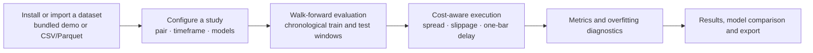
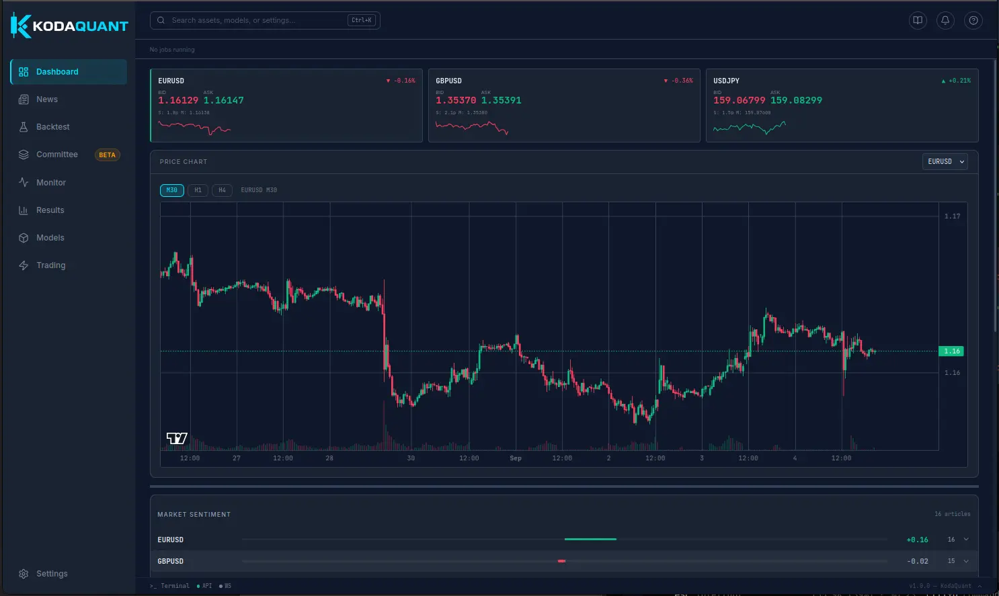
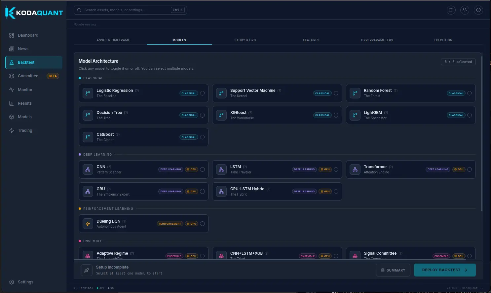
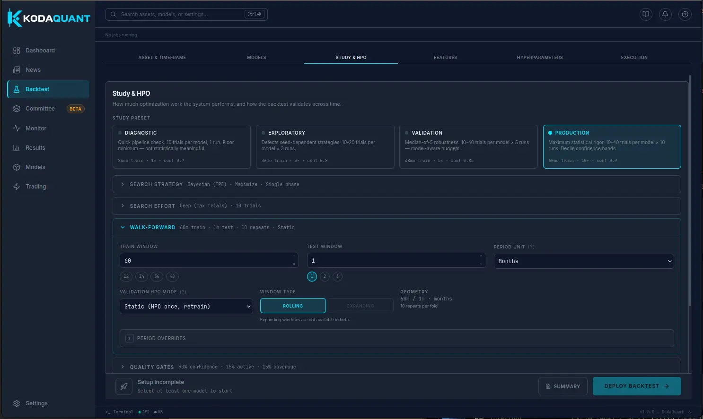
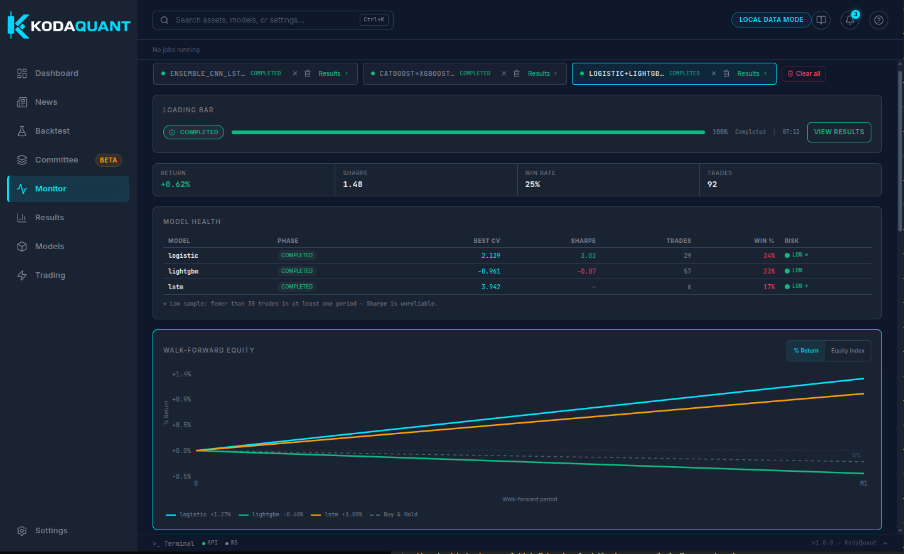
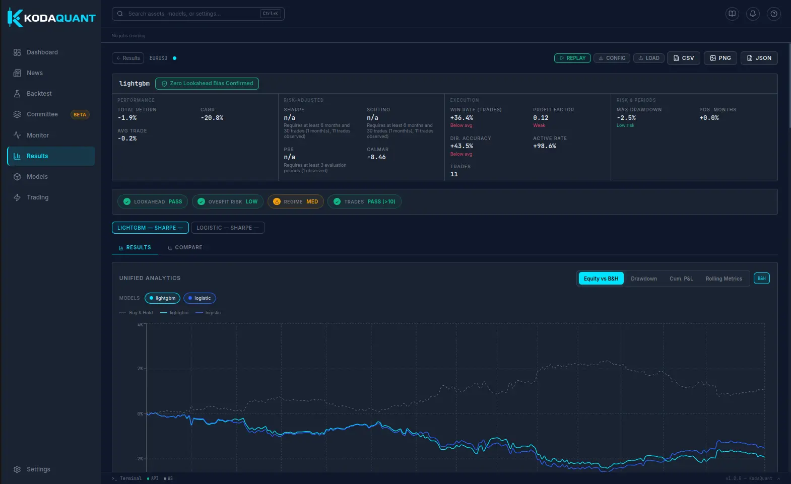
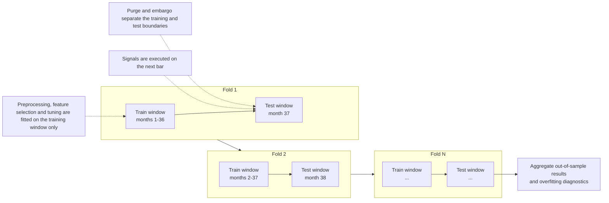
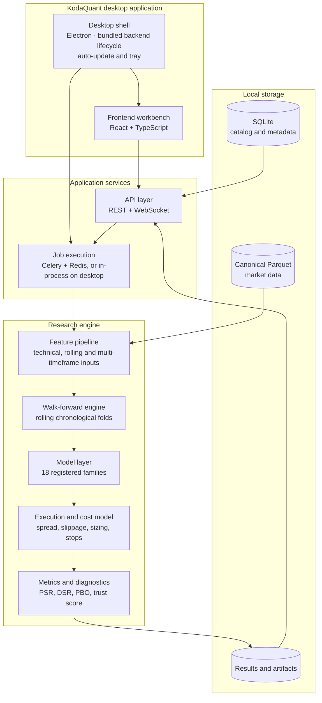

# KodaQuant

**Desktop research application for evaluating FX trading strategies — machine-learning and rule-based — under chronological walk-forward validation.**

[](https://github.com/rafa9-labs/kodaquant-releases/releases/latest)
[](#installation)
[](#limitations)

This repository hosts the official KodaQuant desktop releases, update metadata, and user documentation. The application source code is private.

**Download:** [Latest release](https://github.com/rafa9-labs/kodaquant-releases/releases/latest) · **Engineering case study:** [How KodaQuant is built](https://www.rafa9-labs.com/projects/kodaquant/engineering)

---

## Overview

KodaQuant is a local-first desktop application for quantitative FX research. It is built around one idea: a backtest is only as useful as the discipline used to produce it. Chronology, transaction costs, and execution delay are treated as part of the system rather than as caveats in a footnote.

You install or import a market dataset, configure a study (instrument, timeframe, model families, features, execution settings, and walk-forward geometry), and run a chronological evaluation. Each fold is fitted on a training window only, then evaluated on the next unseen window. Folds advance forward without shuffling and aggregate into performance metrics and overfitting diagnostics.

KodaQuant is intended for quantitative researchers, data scientists, and technically minded traders who want to compare strategies and model families under consistent, leak-aware evaluation. It is **research software**: the stable release does not place live broker orders.

## What KodaQuant Is For

KodaQuant is designed for work such as:

- **FX strategy research** on installed historical datasets.
- **Model evaluation and comparison** across classical, deep, reinforcement-learning, and ensemble families under one evaluation contract.
- **Feature experiments** with configurable technical indicators, rolling statistics, and multi-timeframe inputs.
- **Walk-forward validation** with chronological splits, purging, and embargo controls.
- **Cost-aware backtesting** where spread, slippage, sizing, stops, and a one-bar execution delay are part of the simulation.
- **Overfitting diagnostics** including CSCV/PBO, deflated Sharpe, PSR, and a trust score.
- **Paper replay** of research output.

What it is **not**:

- It is not a live-trading product. The stable release exposes no broker order path; live and committee engines remain compatibility code and are not a production safety certification.
- It is not investment advice, and it does not forecast markets.
- It is not a market-data provider. You supply data by installing the bundled demo or importing your own CSV/Parquet files.

## Research Workflow



In practice: choose an instrument and timeframe, select one or more model families, set the study and walk-forward geometry, run the backtest, watch progress in **Monitor**, then inspect metrics, equity, drawdown, and diagnostics in **Results** and compare models side by side. Results can be exported to CSV, PNG, and JSON.

## Key Features

**Research**
- Chronological walk-forward evaluation with rolling windows, purging, and embargo controls.
- Configurable study presets that range from a quick diagnostic to a production-scale search.
- Optuna-based hyperparameter optimisation with a tiered parameter model.
- Reproducible runs with configurable seeds and repeat counts.

**Machine learning**
- One model registry covering classical, deep-learning, reinforcement-learning, and ensemble/regime-routing families.
- Train-only preprocessing: imputation, scaling, feature selection, and fitting are applied to the training slice and carried into validation.
- Overfitting diagnostics: PSR, deflated Sharpe ratio (DSR), CSCV/PBO analysis, HAC-style reliability, and a combined trust score.

**Backtesting and execution**
- Cost-aware simulation with spread and slippage, optional impact/TWAP models, and a one-bar signal-to-execution delay.
- Position sizing: fixed, fixed-fractional, Kelly, ATR, and volatility-target methods.
- Stops and exits: fixed or volatility-derived levels, breakeven, trailing (fixed pips, ATR, chandelier), partial close, and scale-out.
- Cost ablation (`TRADING_COSTS=0`) to compare gross and net results.

**Analysis**
- Performance metrics, trade statistics, monthly breakdowns, and walk-forward fold tables.
- Model comparison, equity overlays, drawdown and rolling metrics, feature importance, confusion matrices, and confidence bands.
- Export to CSV, PNG, and JSON.

**Application**
- Local-first Electron desktop application with a bundled backend — no Docker, Redis, or Celery required for normal use.
- Dashboard, Backtest, Monitor, Results, Models, Committee (beta), Trading, News, and Settings screens.
- Offline bundled demo dataset and local paper replay.
- Automatic update checks through GitHub Releases.

## Screenshots

| Dashboard | Backtest — model selection |
| --- | --- |
|  |  |

| Backtest — study and walk-forward setup | Monitor |
| --- | --- |
|  |  |



## Installation

Downloads are published on the [latest release](https://github.com/rafa9-labs/kodaquant-releases/releases/latest) page. Public builds are provided for **Windows x64** and **Linux (AppImage)**.

### Windows

1. Download **`KodaQuant-Setup-1.0.0.exe`** from the latest release.
2. Run the installer and choose an install location; it creates Start Menu and desktop shortcuts.
3. The installer is **currently unsigned**, so Windows SmartScreen may show a warning. Choose **More info → Run anyway** to continue.
4. Updates are handled by the application's built-in updater.

### Linux

1. Download **`KodaQuant-1.0.0.AppImage`** from the latest release.
2. Make it executable:
   ```bash
   chmod +x KodaQuant-1.0.0.AppImage
   ```
3. Run it:
   ```bash
   ./KodaQuant-1.0.0.AppImage
   ```
4. If your system does not have FUSE (`libfuse.so.2`), run the AppImage with extract-and-run instead:
   ```bash
   ./KodaQuant-1.0.0.AppImage --appimage-extract-and-run
   ```

The Linux build is produced on Ubuntu; other glibc-based distributions may work but are not the primary target. Application data is stored under the Electron user-data directory, normally `~/.config/kodaquant/data` on Linux.

### macOS

macOS is **not currently distributed**. The public builds are Windows and Linux only.

## Getting Started

The bundled offline demo dataset installs on first launch when the data catalog is empty, so you can run a study immediately without importing data.

1. **Launch KodaQuant.** The Dashboard shows market context, a price chart, and market sentiment.
2. **Open Backtest.** The setup is organised into tabs: **Asset & Timeframe**, **Models**, **Study & HPO**, **Features**, **Hyperparameters**, and **Execution**.
3. **Choose an instrument and timeframe.** The default is `EURUSD` on `H1`.
4. **Select models.** Pick up to five model families to train and compare in one run.
5. **Configure the study.** Choose a preset — Diagnostic, Exploratory, Validation, or Production — and set the walk-forward geometry (training window, test window, and period unit of months, weeks, or days).
6. **Configure features, hyperparameters, and execution.** Enable technical features, review model parameters, and define account sizing and risk-control rules.
7. **Deploy the backtest.** Progress appears in **Monitor**, which tracks jobs, model health, and walk-forward equity.
8. **Inspect the results.** **Results** reports performance, risk-adjusted, execution, and risk/period metrics, plus overfitting badges. Use the **Compare** tab for model comparison and the export buttons for CSV, PNG, and JSON.

To research your own data, import a CSV or Parquet dataset (see [Data](#data)).

## Walk-Forward Methodology

Random cross-validation is not valid for ordered market data, so KodaQuant evaluates chronologically from end to end.



Each fold:

- **Trains** on one chronological window. Imputation, scaling, feature selection, and model fitting are fitted on that training slice only.
- **Purges** training rows whose forward label horizon overlaps the validation window.
- **Embargoes** boundary bars between the training and validation blocks.
- **Tests** on the next held-out window, which is never used to fit the model.
- **Advances** forward by one test period, without shuffling.
- **Repeats**, then aggregates the out-of-sample folds into metrics and diagnostics.

Additional boundary controls include end-exclusive validation comparisons, test warm-up bars that load indicator state without training on it, and an initial embargo region that can be dropped from final test windows. The pipeline default is a monthly rolling window (a 36-month training window and a one-month test window); study presets use longer training windows, and the period unit can be set to months, weeks, or days.

These controls reduce common evaluation errors. They are **not** a guarantee that a result is leak-free or that any strategy will be profitable. Historical and simulated results do not predict future performance.

## Models

The registry currently contains **18 model families**, all selectable in the current release:

| Family | Models |
| --- | --- |
| Classical | Logistic Regression, Support Vector Machine, Random Forest, Decision Tree, XGBoost, LightGBM, CatBoost |
| Deep learning | CNN, LSTM, Transformer, GRU, GRU-LSTM Hybrid |
| Reinforcement learning | Dueling DQN |
| Ensemble and regime routing | Adaptive Regime, CNN+LSTM+XGBoost, Signal Committee, Stacking Ensemble, Regime Classifier |

The Regime Classifier classifies market state for routing and exploration; it is not a standalone directional signal model. Hyperparameters are defined in a single tiered source of truth and rendered to the UI from the API, so the interface does not duplicate model definitions.

## Data

KodaQuant treats historical market data as **installed datasets** rather than data that is re-fetched on demand.

- **Bundled demo** — an offline, deterministic package covering `EURUSD`, `GBPUSD`, and `USDJPY` at `M30`, `H1`, and `H4` over five years. It installs automatically on first launch when the catalog is empty.
- **CSV / Parquet import** — import your own files. The importer detects a timestamp column and OHLC columns, normalises timestamps to UTC, validates OHLC consistency, removes duplicates, and stores immutable canonical fragments.
- **Pair registry** — `EURUSD`, `GBPUSD`, `USDJPY`, `AUDUSD`, `USDCAD`, `GBPJPY`.

Accepted import columns:

| Field | Accepted column names |
| --- | --- |
| Time | `time`, `date`, `datetime`, `timestamp`, `date_time`, `open_time` |
| Open / High / Low / Close | `open`/`high`/`low`/`close` (also `o`/`h`/`l`/`c`, and `mid_*`; close also accepts `adj close`) |
| Volume (optional) | `volume`, `vol`, `v` |
| Spread (optional) | `spread` |

Naive timestamps are treated as UTC; timezone-aware timestamps are converted to UTC. The timeframe is inferred from the median spacing between timestamps. A minimal example:

```csv
time,open,high,low,close
2024-01-01T00:00:00Z,1.1032,1.1041,1.1027,1.1038
2024-01-01T01:00:00Z,1.1038,1.1050,1.1035,1.1046
```

Canonical storage is checksummed Parquet described by a local SQLite catalog, so a dataset can be version-pinned and reproduced later. Corrupt or missing data is reported explicitly rather than silently substituted.

## Cost-Aware Evaluation

Transaction costs are part of the simulation, not an afterthought. The execution loop supports:

- **Spread and slippage**, with spread guards and optional impact/TWAP models.
- **Position sizing** — fixed, fixed-fractional, Kelly, ATR, and volatility-target methods.
- **Stops and exits** — fixed or volatility-derived stop-loss and take-profit levels, breakeven, trailing (fixed pips, ATR, chandelier), partial close, and scale-out.
- **A one-bar execution delay** — the signal is evaluated on the next bar, and stops and take-profits have explicit fill accounting instead of skipping the triggering bar.
- **Cost ablation** — `TRADING_COSTS=0` produces a no-cost comparison so gross and net results can be read side by side.

Risk breakers (drawdown, daily-loss, and consecutive-loss limits) are operational in the live/paper path. Their historical-backtest thresholds are deferred in this beta; backtest execution supports sizing, stops, and trailing controls.

## Metrics and Results

The Results screen reports the following metrics, grouped as they appear in the application:

| Group | Metrics |
| --- | --- |
| Performance | Total return, CAGR, average trade |
| Risk-adjusted | Sharpe, Sortino, PSR, Calmar |
| Execution | Win rate (trades), directional accuracy, active rate, profit factor, trade count |
| Risk and periods | Maximum drawdown, positive months |

Additional diagnostics include CSCV/PBO (probability of backtest overfitting), deflated Sharpe ratio (DSR), HAC/Newey-West-style reliability, a trust score, feature importance, prediction histograms, confusion matrices, confidence bands, and per-fold walk-forward tables.

Metrics measure the behaviour of a simulated strategy under a specific configuration. They are comparable across runs only when the data window, feature policy, cost configuration, execution timing, model set, and seed policy are held constant. Short runs may not produce enough trades for the statistical diagnostics to be defined, and the application reports that rather than inventing a number.

## Architecture

KodaQuant ships as a single desktop application that starts its own bundled backend. In the containerised service configuration, the same backend is split into API and worker processes.



| Component | Responsibility |
| --- | --- |
| Desktop shell | Starts the bundled backend, waits for its health check, loads the workbench, and manages the tray, restart, shutdown, and update checks. |
| Frontend workbench | React and TypeScript interface for datasets, backtests, monitoring, results, models, news, committee, and settings. |
| API layer | Typed REST and WebSocket surface for jobs, datasets, models, results, and progress. |
| Job execution | Durable job records dispatched to workers; Celery and Redis in service mode, an in-process manager on the desktop. |
| Feature pipeline | Technical indicators, rolling statistics, multi-timeframe inputs, and chronology-safe joins. |
| Walk-forward engine | Rolling chronological folds with purging and embargo controls. |
| Model layer | One registry and training/prediction contract across all model families. |
| Execution and cost model | Bar-by-bar simulation with costs, sizing, stops, and a one-bar delay. |
| Metrics and diagnostics | Performance metrics and overfitting diagnostics. |
| Local storage | Canonical Parquet market data, a SQLite catalog, and generated result artifacts. |

## Local-First and Privacy

KodaQuant runs on your machine.

- The packaged application starts its own loopback backend and stores data under the Electron user-data directory (SQLite catalog, Parquet market data, configuration, and generated results).
- No telemetry is sent by default. Optional crash reporting uses Sentry and starts **only** when a DSN is explicitly provided in a production build; it is disabled otherwise and does not send personal data.
- Provider credentials, when a user configures them, are stored in the operating system keychain. They are not required for the demo or for local CSV/Parquet research.
- Optional external services are off unless you enable them: live news uses public RSS feeds and caches results locally; hosted LLM and news providers require user-supplied keys; market-data provider downloads are disabled in this release.
- The stable release does not connect to a broker to place orders.

## Updates

KodaQuant checks for updates through GitHub Releases using `electron-updater`. Update checks, download progress, and install prompts are handled inside the application, and the application restarts to apply a downloaded update.

Normal users do **not** need to download the updater metadata by hand. The release page also includes `latest.yml` and `latest-linux.yml` (update manifests) and a `.blockmap` file (for delta downloads); these support the updater infrastructure and are consumed by the application automatically.

## Verifying Downloads

Each release includes **`SHA256SUMS.txt`** with the SHA-256 checksum of every release file. After downloading, compute the checksum and compare it to the matching line in that file.

Windows:

```powershell
certutil -hashfile KodaQuant-Setup-1.0.0.exe SHA256
```

Linux:

```bash
sha256sum KodaQuant-1.0.0.AppImage
```

Compare the printed hash to the value in `SHA256SUMS.txt` for the same filename. If they differ, do not run the file and re-download from the official release page.

## Limitations

- **Research software.** KodaQuant evaluates simulated strategies. It does not provide financial advice, and simulated or historical results do not guarantee future performance.
- **No live execution in the stable release.** Broker execution is not exposed. Live and committee engines remain compatibility code and require manual testing before any use; paper replay is the supported path.
- **Markets.** FX only. The bundled demo covers three pairs; the pair registry lists six; other instruments require a CSV/Parquet import.
- **Platforms.** Windows x64 and Linux AppImage are published. macOS is not distributed.
- **Windows signing.** The installer is unsigned, so SmartScreen may warn.
- **Compute.** Deep-learning families and large hyperparameter searches are compute-intensive. A CUDA-capable GPU is supported but optional; classical models run on CPU.
- **Statistical diagnostics need data.** Short runs can produce too few trades or evaluation periods for Sharpe, PSR, and related diagnostics to be defined.
- **Beta surfaces.** The Committee screen is marked beta. Walk-forward windows ship as **rolling** only (expanding windows exist in the pipeline but are not exposed in this beta), configurable walk-forward embargo geometry is deferred, and injecting historical news/sentiment into backtests is deferred (the live News screen remains active).
- **Timeframe handling.** Selected-timeframe persistence between the setup UI and the backend has known rough edges in this beta; verify the asset and timeframe shown in the run summary before relying on a result.

## Releases

- **Latest release:** <https://github.com/rafa9-labs/kodaquant-releases/releases/latest>
- **All releases:** <https://github.com/rafa9-labs/kodaquant-releases/releases>

Versions follow semantic versioning (`vMAJOR.MINOR.PATCH`). The current release is `v1.0.0`. Release notes for each version are on the releases page.

## Engineering Case Study

For architecture decisions, technical trade-offs, implementation challenges, and the development methodology behind KodaQuant:

**[View the KodaQuant engineering case study →](https://www.rafa9-labs.com/projects/kodaquant/engineering)**

## Source and License

KodaQuant's application source code is private. This repository contains the public distribution artifacts and this documentation; it is not an open-source release. The application and its release binaries are provided for end use.

## Disclaimer

KodaQuant is research software and does not constitute financial advice. Historical or simulated results do not guarantee future performance. Always validate any research independently before making financial decisions.
